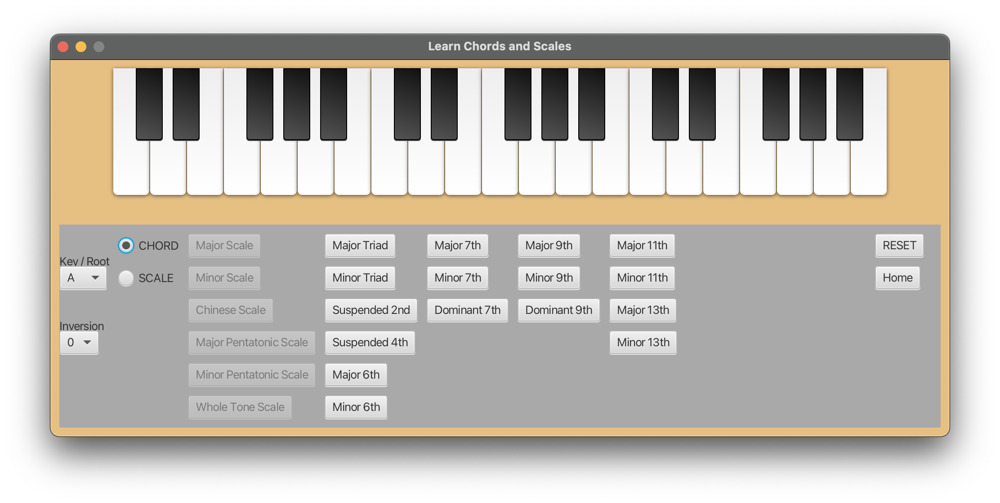
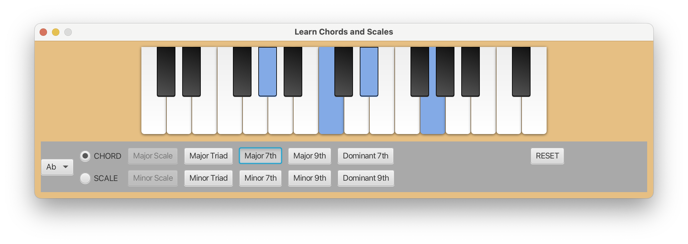
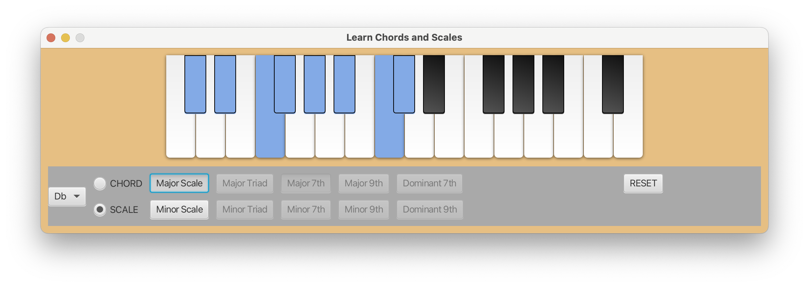
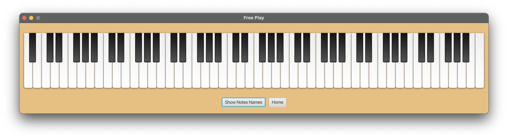

# midiP

A JavaFX MIDI multipurpose application with the following functionalities

- Displaying scales and common chords for a given key / root

  - 
  - 
  - 
  - 

- An 88 keys open keyboard for free play (no sounds, yet)

## How to run this application

Maven support was recently added to this project to facilitate cross-platform compatibility.
To run the application, compile and run Main.java in the `views` folder. 

## What's next?

- Refactoring the code and tightening up the functionalities.
- Adding sounds to the free play keyboard.
- Publishing version 0 of the application.
